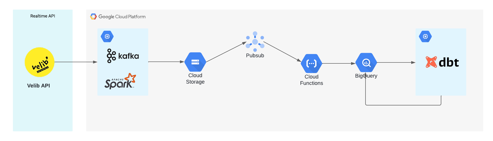

# Velib Streaming

This project focuses on enhancing the efficiency of processing data from the Vélib' real-time API. By establishing a robust pipeline, the system automatically collects, transforms, and stores the data, making it readily available for analytical purposes. 
The project include the following steps: 
- Setup kafka producer to publish data to a defined topic
- Leaverage spark as a consumer to benefit from the microbatch streaming and ingest data at precise frequencies
- Ingest data to datalake (in our case gcp storage bucket)
- Setup notification system to trigger a cloud function responsible for replicating data to the warehouse (bigquery) whenever a new file is added to the bucket, this is done through gcp pubsub and cloud functions
- Connect bigquery to dbt to make the needed transformations 
The overall architecute is presented in the architecture below: 
